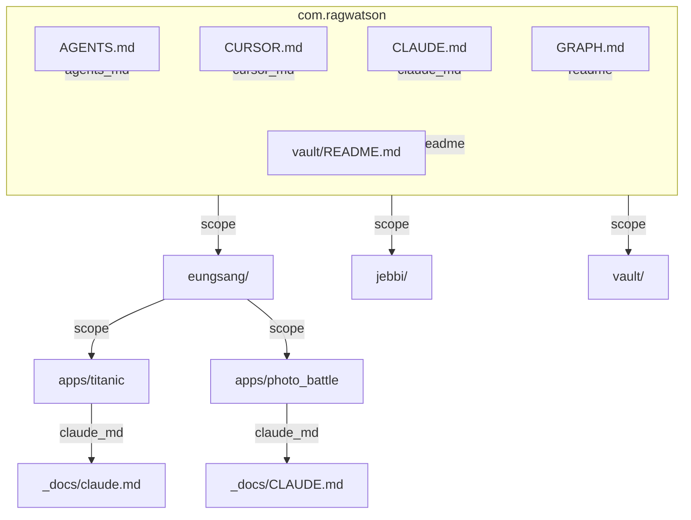

# com.ragwatson — 하네스 그래프 (Obsidian · Cursor)

에이전트·Obsidian 그래프 뷰에서 **프로젝트 루트 ↔ 하네스 문서** 관계만 본다.  
코드·`src/`·패키지 트리는 포함하지 않는다.

**인터랙티브 미리보기:** Cursor 캔버스 `harness-graph.canvas.tsx` (채팅 옆에서 열기)

---

## 1. 그래프 구성 규칙

### 루트 점 (scope)

| scope 선택 | 루트 점 |
|------------|---------|
| 모노레포 전체 | `com.ragwatson` + `eungsang/` · `jebbi/` · `vault/` + `_docs`가 있는 `eungsang/apps/{app}/` |
| `eungsang/` | `eungsang/` + `eungsang/apps/*/` (앱당 1점, 1 depth) |
| `jebbi/` | `jebbi/` (+ `jebbi/apps/*/` 패턴 동일) |
| `vault/` | `vault/` 단일 루트 |

### 프로젝트 루트에 연결하는 문서 (앱·스택)

- **`_docs/CLAUDE.md`** (또는 `_docs/claude.md`)
- **`_docs/.cursorrules`**
- 위 두 종류만. `_docs`의 기타 `.md`(ERD, 가이드 등)는 **연결하지 않음**.

### 모노레포 루트(`com.ragwatson`)에 추가 연결

- `AGENTS.md` · `CURSOR.md` · `CLAUDE.md` · `GRAPH.md`
- `vault/README.md`
- `docs/` (존재 시)

### 엣지 (한 줄 = 한 종류)

| 종류 | 의미 |
|------|------|
| `claude_md` | 루트 ↔ `_docs/CLAUDE.md` |
| `cursorrules` | 루트 ↔ `_docs/.cursorrules` |
| `agents_md` | 모노레포 루트 ↔ `AGENTS.md` |
| `cursor_md` | 모노레포 루트 ↔ `CURSOR.md` |
| `readme` | 모노레포 루트 ↔ `README`/`GRAPH` 등 |
| `vault_readme` | 모노레포 루트 ↔ `vault/README.md` |
| `scope` | 상위 scope ↔ 형제·앱 루트 (폴더 계층) |

`depends` 는 `_docs/CLAUDE.md`에 **명시된 경우만** 추가한다 (현재 스냅샷에는 없음).

---

## 2. 현재 스냅샷 (2026-06-22)

### 루트 · 형제

| 루트 | 연결 문서 | 상태 |
|------|-----------|------|
| `com.ragwatson` | AGENTS.md, CURSOR.md, CLAUDE.md, GRAPH.md, vault/README.md | ✅ |
| `eungsang/` | `_docs/*` 없음 (`_claude/CLAUDE.md`는 스택 원본, 그래프 spec 외) | 루트만 |
| `jebbi/` | `_docs/CLAUDE.md` 없음 | 루트만 |
| `vault/` | README.md (모노레포 루트에서 `vault_readme`로도 연결) | ✅ |

### `eungsang/apps/*/` ( `_docs` 보유 )

| 앱 | claude_md | cursorrules |
|----|-----------|-------------|
| `titanic` | `_docs/claude.md` ✅ | ❌ 미생성 |
| `photo_battle` | `_docs/CLAUDE.md` ✅ | ❌ 미생성 |
| `silicon_valley` | `_docs/` 빈 폴더 | — |

---

## 3. Mermaid — 모노레포 scope

---

## 4. Obsidian 색상 그룹 (기존)

그래프 뷰 **설정 → 그룹** 쿼리. Obsidian에서 그래프를 다시 열거나 `Cmd+R`로 새로고침.

| 색 | 범위 | 쿼리 |
|----|------|------|
| 🟠 주황 | 타이타닉 앱 | `path:apps/titanic` |
| 🟢 청록 | Photo Battle 앱 | `path:photo_battle` |
| 🔵 파랑 | 백엔드 DEVOPS (구) | `path:DEVOPS/Backend` |
| 🟢 초록 | 프론트 DEVOPS (구) | `path:DEVOPS/Frontend` |
| 🔵 하늘 | `eungsang/` | `path:eungsang` |
| 🟢 민트 | `jebbi/` | `path:jebbi` |
| 🟣 보라 | `vault/` | `path:vault` |
| 🔴 빨강 | `.cursorrules` | `file:.cursorrules` |
| 🟡 금색 | 루트 하네스 | `path:AGENTS OR path:CURSOR OR file:CLAUDE.md` |
| ⚫ 회색 | `_harness/` | `path:_harness` |
| ⚪ 슬레이트 | Docker | `file:Docker-compose` |

### Wiki 허브 (Obsidian 링크)

- [[CLAUDE|루트 CLAUDE]]
- [[AGENTS]]
- [[CURSOR]]
- [[eungsang/_claude/CLAUDE|eungsang CLAUDE (원본)]]
- [[jebbi/_claude/CLAUDE|jebbi CLAUDE (원본)]]
- [[eungsang/apps/titanic/_docs/claude|titanic CLAUDE]]
- [[eungsang/apps/photo_battle/_docs/CLAUDE|photo_battle CLAUDE]]
- [[vault/README|vault README]]
